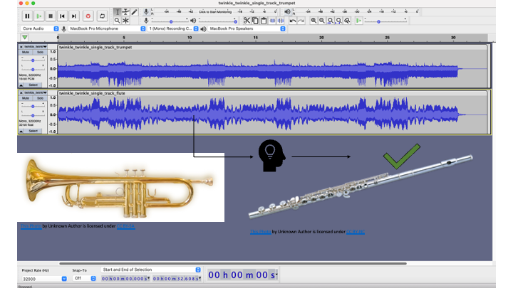

# MusicML : Instrument Classification (Status : Data Exploration , Data pipeline is "Work in Progress")
 
 This project tries to identify music instument from raw audio. Current version is expeted to identify (classify) if the audio file has only one instrument. 
 

